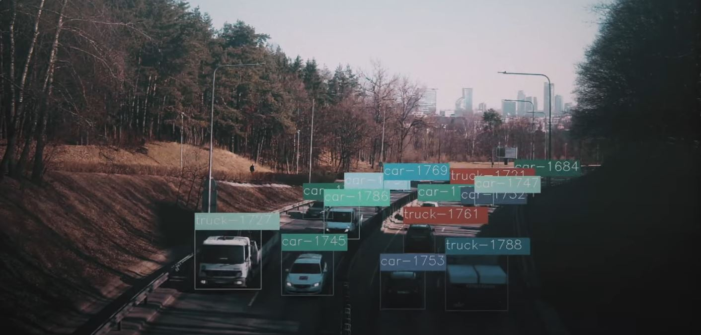

# TRAFFIC JAM SESSION

Audio-visual experiment based on computer vision technology. The script, written in Python, detects and tracks vehicles from camera video stream. Detected objects are given a unique ID with randomly assigned notes in predefined harmony. Script sends midi messages to a digital audio workstation when an object is tracked. Due to script processing time, there is little mismatch between audio and video material.

Youtube link:
https://www.youtube.com/watch?v=OHDmjZBh84I
